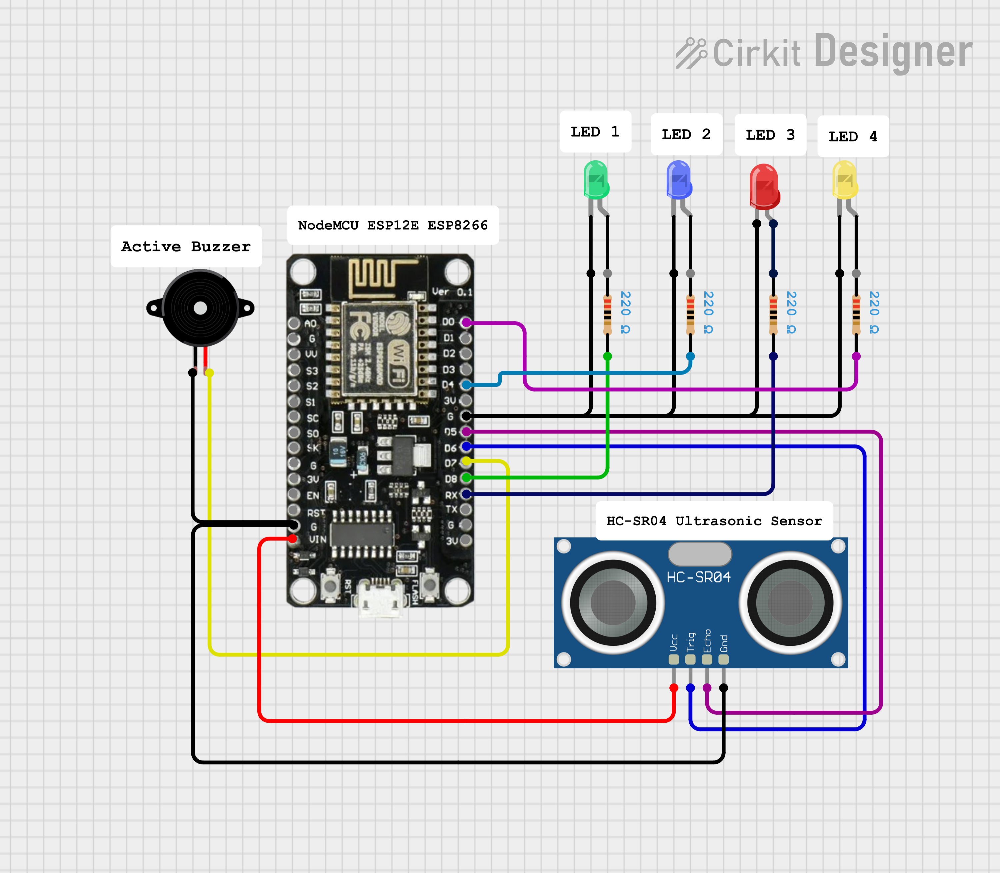

# IoT-Based Flood Detection System with Blynk

> **Updated:** Removing OLED Functionalities

## Video Demo

Watch it on TikTok: [Video Demonstration](https://www.tiktok.com/@qubits.io/video/7530842254420774162?is_from_webapp=1&sender_device=pc&web_id=7491002461630400008)

---

## Project Overview

This is an IoT-based flood detection system using **ESP8266**, **HC-SR04 ultrasonic sensor**, and the **Blynk IoT platform**.

**Features:**

* Distance monitoring in **cm** & **inches**
* **LED indicators** for water level thresholds
* **Buzzer alarm** for high water levels
* Optional cloud logging via `Blynk.logEvent("high_water_levels")`

---

## Disclaimer

This project is intended for educational and prototyping purposes only.
It should not be relied upon as a primary flood warning system for life safety or property protection.

Always use certified and government-approved flood detection/alert systems in real-world applications.

The Author are not responsible for any damage, loss, or injury that may result from the use of this project.

---

## Hardware Components

| Component                 | Description                    |
| ------------------------- | ------------------------------ |
| ESP8266 NodeMCU           | Main Wi-Fi microcontroller     |
| HC-SR04 Ultrasonic Sensor | Measures water level           |
| Buzzer                    | Audible alert                  |
| Red, Blue, Green LEDs     | Visual alerts for water levels |
| Yellow LED                | Blynk connection indicator     |
| 220Ω Resistors (x3)       | LED current-limiting           |
| Jumper Wires              | Connections                    |
| Breadboard                | Prototyping                    |

---

## Circuit Diagram 



---

## Pin Connections

| Component  | Pin Label | ESP8266 GPIO | NodeMCU Pin |
| ---------- | --------- | ------------ | ----------- |
| Ultrasonic | Trig      | GPIO12       | D6          |
|            | Echo      | GPIO14       | D5          |
| Buzzer     | +         | GPIO13       | D7          |
| Red LED    | +         | GPIO3        | RX (D9)     |
| Blue LED   | +         | GPIO2        | D4          |
| Green LED  | +         | GPIO15       | D8          |
| Yellow LED | +         | GPIO16       | D0          |

---
## Blynk Setup

1. Install **Blynk IoT App** (Android/iOS)
2. **Create a New Template:**

   * Name: `Flood Detection`
   * Hardware: `ESP8266`, Wi-Fi
   * Save **Template ID**, **Device Name**, **Auth Token**
3. **Create a New Device** using your template
4. Add **Label/Gauge widgets:**

   * `V1` → Distance (cm)
   * `V2` → Distance (inches)
5. Insert credentials into Arduino code:

```cpp
#define BLYNK_TEMPLATE_ID   "YourTemplateID"
#define BLYNK_TEMPLATE_NAME "Flood Detection"
#define BLYNK_AUTH_TOKEN    "YourAuthToken"
char ssid[] = "YourWiFiSSID";
char pass[] = "YourWiFiPassword";
```

6. Optional: Enable cloud events in Blynk and trigger using `Blynk.logEvent("high_water_levels")`

---

## Libraries Required

* `Blynk`
* `ESP8266WiFi`

> **Note:** OLED libraries are **not required** for this version.

---

## Upload Code

1. Connect ESP8266 via USB
2. Open `.ino` sketch and insert Wi-Fi & Blynk credentials
3. Click **Upload**
4. Open **Serial Monitor** at `115200` baud to verify connection

---

## Viewing Data

* Monitor **V1** (cm) & **V2** (inches) on Blynk dashboard
* Optional: set alerts for `high_water_levels`

---

## License

This project is licensed under the **MIT License**. See the [LICENSE](LICENSE) file for full details.

--- 

## Author

- Created with passion ❤ by: **Roy Cuadra**
- Updated Date: 10-24-2025

---

**Thank you for checking out this project!** 
You are welcome to **fork**, **improve**, or **use** it for learning purposes.